# Day 1:
- Phase 1:

- Confirmed VT-x enabled, set up GitHub repo and cloned into VS Code

- Installed VirtualBox. This is because this project needs 3 separate "computers", a Domain Controller, a Windows client, and a Splunk server, all networked together. Also, safety is a reason. I plan on running an actual password-spray attack tool, and I don't want that running on my real everyday laptop. 

- Downloaded Windows Server. This is the operating system that will run inside my DC01 VM. It's the "brain" of my mini network. It's the OS that's capable of being promoted into a Domain Controller: a server that manages user accounts, logins, and security policy for every other machine that joins its domain. Windows 11 can't do this, only Windows Server can run Active Directory. I'm using the evaluation version because its a free trial for 180 days. This is needed because the password spray attack targets accounts on this domain controller. Without it, theres no domain, no test accounts, no realistic AD logs to detect anything in. 

- Downloaded Windows 11. This is what runs inside my CLIENT01 VM. It's the "employee workstation" of my mini network. In a real company, this would represent someones actual laptop/desktop thats joined to the company domain. This matters because this is the VM where the actual attack gets launched from, aiming at the test accounts sitting on DC01. It's also where I'll do my baseline logins - logging in, entering a wrong password - since that's the everyday activity a real employee's machine generates.  

- Downloaded Ubuntu server. This is the OS for SPLUNK01 (the machine thatll run SPLUNK, my SIEM). Ubuntu is used here because Splunk runs great on Linux, Linux servers are lighter on resources than Windows ones, and using a different OS for the SIEM mirrors how a real company keeps it security tooling on separate, dedicated infrastructure rather than crammed into the same box its monitoring. This VM is the "security camera room". DC01 and CLIENT01 will both forward their Windows event logs here (via the Splunk Universal Forwarder), and this is where I'll search through that data, spot the password spray pattern, and build my detection rule. Without this machine, I'll have logs sitting on the domain controller with nobody watching them. 

- Here I will document the network name. The reason I need to have a network name is because every VM I build will need to reference this exact name to join the same private network. The network name I'll go for is "detectionlab"

- Here I will log the IP scheme. This is so when I'm deep in Windows Server's network settings, I can just look back here and type it in. 
- IP Plan: 
   - DC01: 192.168.56.10
   - CLIENT01: 192.168.56.20
   - SPLUNK01: 192.168.56.30

- Here I will note which VM's get temporary internet access. 
   - DC01: stays internal network only from the start (installing from local ISO, no internet needed)
   - CLIENT01: may get temporary NAT adapter if an attack tool needs downloading
   - SPLUNK01: gets temporary second NAT adapter (needs internet for Splunk install + apt updates)
- All temporary NAT adapters get disabled before attack simulation

- Phase 2: 

- Created DC01 VM:
   - 4096 MB RAM, 2 CPUs, 60GB dynamically allocated VDI disk, attached Windows Server evaluation ISO.
   - Chose 4GB RAM because its a comfortable minimum for a Domain Controller running Active Directory. 
   - Used a dynamically allocated disk so it only takes up real storage as data is actually added, rather than reserving 60GB upfront. 
   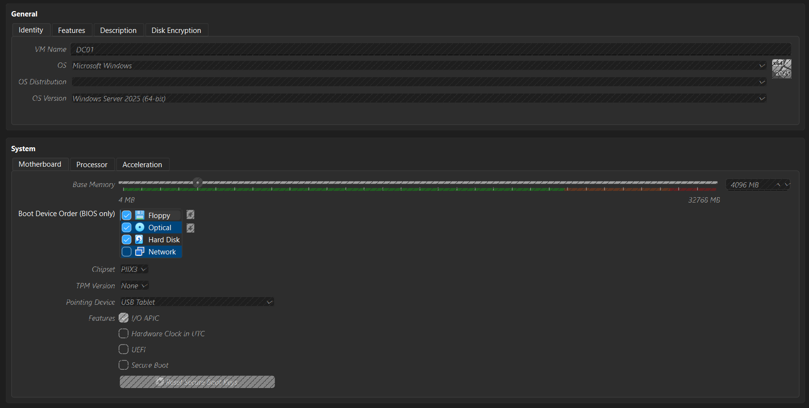

   - Set DC01's network adapter to Internal Network, named "detectionlab". This is the moment the isolated lab network actually gets created in VirtualBox. It doesnt exist until a VM references it by name. DC01 has no NAT/internet adapter at all, since it installs entirely from the local ISO and never needs to reach the internet.
   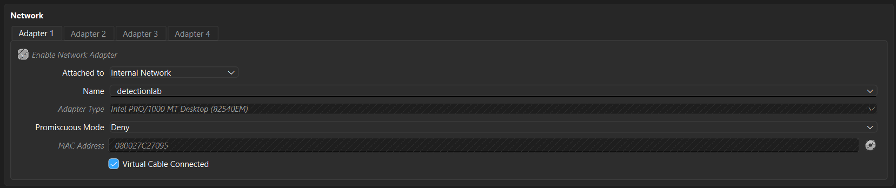

   - Issue: faced a small issue when attempting to choose Internal Network. VirtualBox's Network settings dropdown only showed 2 of the available adapter types (NAT, Bridged Adapter). This was potentially a display/rendering bug in the VirtualBox GUI rather than a config mistake. 
   - Fix: used VirtualBox's command line to set the adapter directly. Typed "C:\Program Files\Oracle\VirtualBox\VBoxManage.exe" modifyvm "DC01" --nic1 intnet --intnet1 detectionlab`, then reopened DC01's settings and confirmed Internal Network (detectionlab) showed correctly. 

   # Day 2

   - Booted DC01 and began the Windows Server Installation. I chose the Desktop Experience because its more useful while learning. Real production servers often use Core instead, to save resources and reduce attack surface.

   - Issue: partway through, got a prompt saying setup detected an upgrade and booted from install media, asking whether to continue the upgrade or do a clean install. This happened because Windows automatically reboots partway through installation to continue setup, and the VM booted from the install ISO again instead of the partially installed hard disk, landing back on the installer screen. Selected "No" (clean install).

   - Continued into disk selection screen again, but this time it showed 3 partitions (EFI, Recovery, and a 59GB main partition already showing used space) rather than one block of unallocated space. This confirms the installation had already progressed once before

   - Fix: shut down DC01, restarted it, and this time did not press a key at the "boot from CD/DVD" prompt, letting it boot from the hard disk instead of the install disc. This correctly resumed installation setup. 

   - Set the built-in Administrator password. Logged into DC01 for first time. Landed in Server Manager, the default tool that opens on Windows Server login, used for managing roles and features. Installed VirtualBox Guest Additions inside DC01. This enables proper mouse integration, automatic display resizing, and shared clipboard. This was done just to make my experience better since I'll spend many hours inside these VM's. 

   - Assigned DC01 a static IP address (192.168.56.10). Subnet mask (255.255.255.0). Default gateway left blank, because a gateway would point to a router providing access to other networks/the internet, and the isolated Internal Network deliberately has no router, so theres nothing to point to. Preferred DNS server (192.168.56.10), same as DC01 address because I will be promoting DC01 to a Domain Controller which will make it the DNS server for the whole lab. Verified with 'ipconfig' in Command Prompt - confirmed IPv4 address and Subnet Mask.
   

   - Promoted DC01 to a Domain Controller, creating a new forest and domain, "lab.local". This is the step that activates AD DS. Without this, theres no domain for CLIENT01 to join and no central authority managing accounts. 

   - Installed AD DS role via Server Manager > Add Roles and Features, then ran the promotion wizard. Chose "add a new forest" (since nothing exists yet in this environment), and named the domain 'lab.local'. Set a DSRM (Directory Services Restore Mode) password. This promotion is also what makes DC01 the domain's DNS server - confirms why the static IP + DNS pointing at itself setup had to happen first, in that order. 

   - Issue: right after installing the AD DS role, clicking "promote to domain controller" gave an error saying role change status couldnt be determined, suggesting a restart was needed. 

   - Fix: restarted DC01, which let the role installation fully settle. Promotion then worked normally. 

   - DC01's sidebar in Server Manager now shows AD DS, DNS, and File and Storage Services. Opened Active Directory Users and Computers and confirmed 'lab.local' appears as an active domain with default containers. 
   
   

   # Day 3

   - Created 7 test user accounts in ADUC inside the default Users container within lab.local. These accounts exist so the later password spray attack has a realistic population to target. Password spraying works by trying a few common password across many accounts, so multiple accounts are needed to meaningfully distinguish normal activity from an attack later. 
   

   - Took DC01's VM snapshot, named "Domain Controller Working". It captures AD DS running, DNS configured, static IP set, and all 7 test accounts created. This is a rollback checkpoint, so just in case if anything breaks later, DC01 can be restored to exactly this state instead of rebuilding from scratch.

   # Day 4

   - Created CLIENT01 VM: selected Windows 11 (64-bit) ISO directly in the creation wizard (unlike DC01, where the ISO was attached separately afterward). Allocated 4096 MB RAM, 2 CPUs, 60GB dynamically-allocated disk. Ticked "Use EFI", which is required for Windows 11, unlike DC01/Windows Server which could use legacy BIOS-style boot. 

   - Left "Proceed with Unattended Installation" unticked deliberately, so the Windows 11 install could be done manually, since I needed control over this to handle Microsoft account bypass later, which an automated unattended install could have skipped past incorrectly. 

   - Issue: same VirtualBox Network dropdown rendering bug as DC01, Internal Network option not selectable. 

   - Fix: same VBoxManage command-line workaround, targeting CLIENT01 this time: &"C:\Program Files\Oracle\VirtualBox\VBoxManage.exe" modifyvm "CLIENT01" --nic1 intnet --intnet1 detectionlab

   - Added a second network adapter (NAT) for temporary internet access, per the network plan. Needed in case attack tools require downloading onto CLIENT01 later on. 

   - Issue: CLIENT01 showed a persistent black screen on boot with no error message after starting the Windows 11 install. Ruled out several causes one at a time: ISO not attached (confirmed attached), boot order (irrelevant with EFI enabled), Secure Boot (tried disabling, no change), host-side Hyper-V/Core Isolation conflicts (checked, not the cause), VirtualBox being outdated (was latest version).

   - Fix: changed Graphics Controller from VBoxSVGA to VMSVGA. This resolved the black screen, a known incompatibility between VBoxSVGA and this specific EFI + very recent Windows 11 build combination. 

   - Issue: Windows 11 setup forced a "Sign in with Microsoft" screen with no visible way to create a local account instead, even after fully disconnecting CLIENT01's network, the network screen only offered to "Install driver" (a dead end since no real adapter/driver exists) rather than showing the expected "I dont have internet" link. 

   - Fix: Pressing Fn+Shift+F10 opened the hidden command prompt, I ran oobe\bypassnro, which restarted the setup flow and made the "I dont have internet" option available, leading to a local account creation instead of a Microsoft account. 

   - Re-enabled both network adapters in CLIENT01's settings, as they were disabled to force the offline setup path during the bypass. 

   - Result: CLIENT01 now running Windows 11 Home with a local account.  

   - Assigned CLIENT01's static IP: 192.168.56.20, subnet mask 255.255.255.0, default gateway blank. Unlike DC01, set Preferred DNS server to 192.168.56.10 (DC01's address), not CLIENT01's own. CLIENT01 doesn't run any DNS service itself, so it needs to ask DC01 whenever it needs to resolve a name like lab.local.
   

   # Day 5

   - Phase 3: CLIENT01 domain job (major troubleshooting) 

   - Issue: attempting to join CLIENT01 to lab.local failed immediately. System Properties showed "You cannot join a computer running this edition of Windows 10 to a domain", with the Domain option greyed out entirely. Root cause: Windows 11 Home doesn't support domain-joining at all. This is a hard Microsoft licensing restriction (Pro/Enterprise/Education only), not a bug or misconfiguration. Traced back to the install ISO defaulting to Home edition since no product key was entered during setup.
   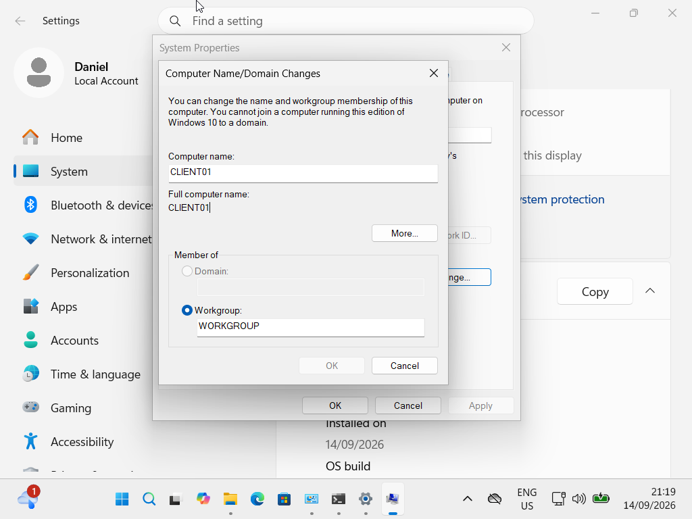

   - Attempted Fix 1: switch edition in-place via Settings > System > Activation > Change Product Key, using Microsoft's public generic Windows Pro setup key (VK7JG-NPHTM-C97JM-9MPGT-3V66T), a legitimate, publicly documented key used for edition-switching, not a piracy workaround. It failed. 
   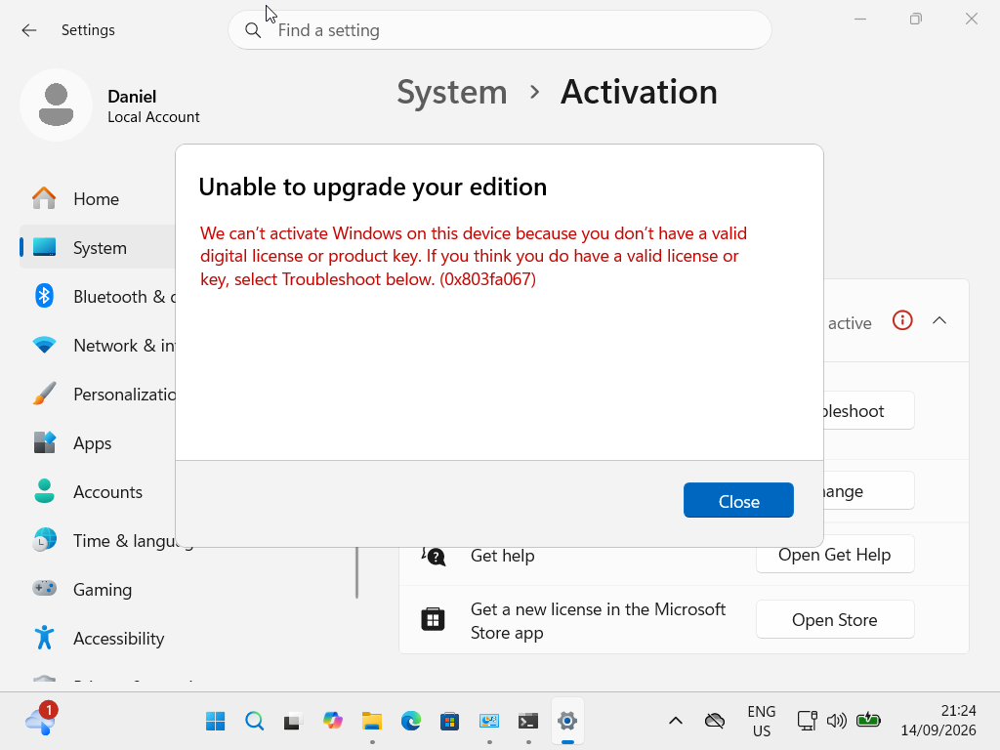

   - Attempted Fix 2: "slmgr /ipk <key>" via elevated Command Prompt (bypasses the Settings UI). Also failed with the same underlying activation error. 
   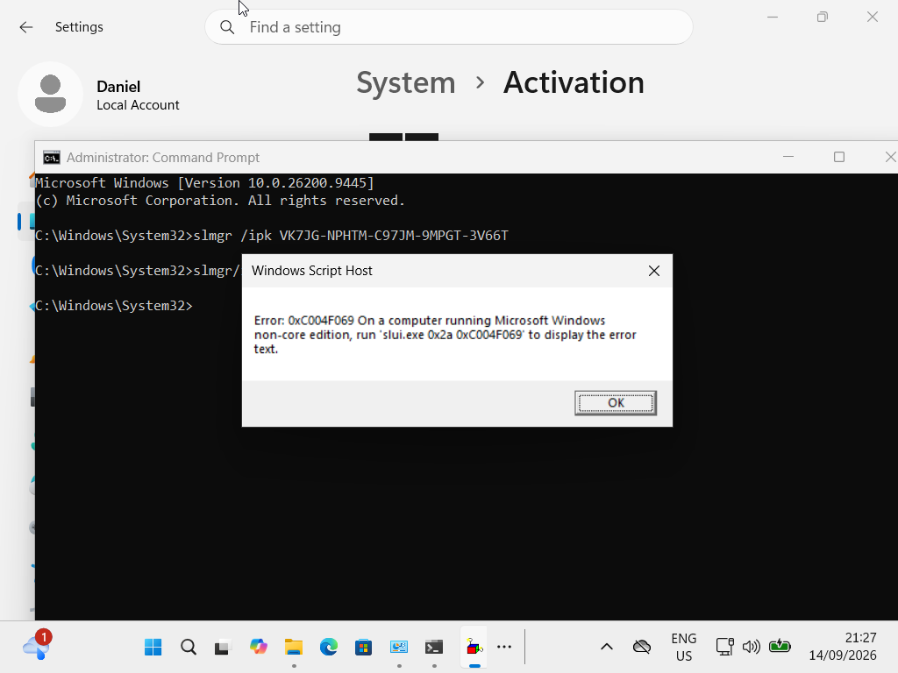

   - Attempted Fix 3: DISM/Online/Set-Edition:Professional /ProductKey:<key>. Failed with "Setting an edition is not supported with online images" error. DISM's Set-Edition only works against an offline image, not a live running OS. 
   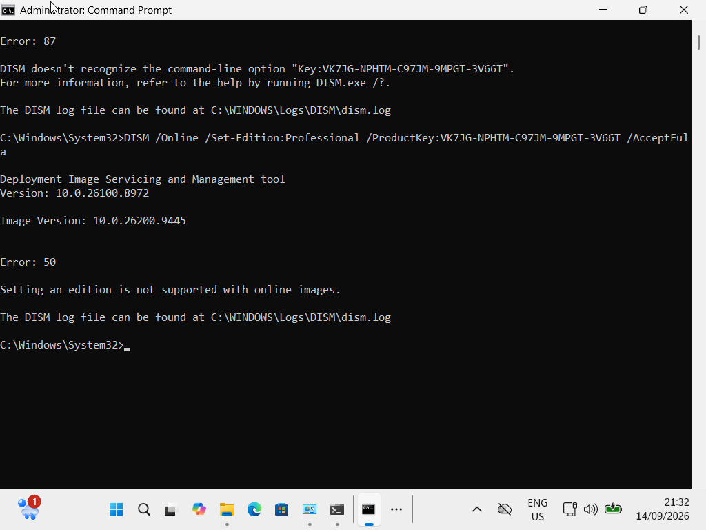

   - Attempted Fix 4: booted into Windows Recovery Environment to run DISM against the drive as a genuinely offline image. Had to locate the correct drive letter first (WinRE reassigns them -D: turned out to be the Guest Additions CD, not Windows; C: was correct, confirmed via "dir C:\Windows"). Hit an error 5023: "The specified offline image has not been generalised. Run sysprep /generalise." Since sysprep would reset most of CLIENT01's existing configuration anyway (similar cost to reinstalling), decided to stop pursuing in place conversion entirely. 
   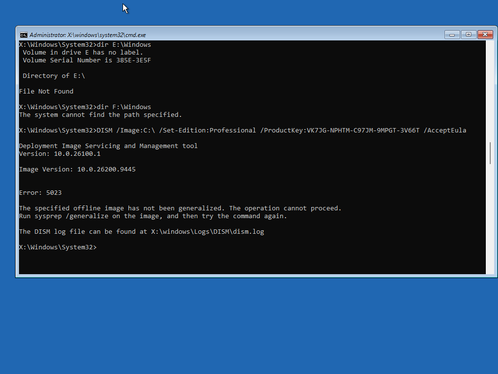

   - Decision: reinstall Windows 11 from scratch, entering the Pro-associated generic key at the initial product key screen during setup, so Pro installs correctly from the start. 

   - Issue: after powering off and restarting CLIENT01 to reinstall, it booted straight back into the existing (old, Home) installation rather than the installer, since EFI firmware prioritises an existing "Windows Boot Manager" entry over the optical drive. Fix: used the EFI Boot Manager menu directly (pressed Esc repeatedly at boot) and manually selected the CD-ROM entry. 
   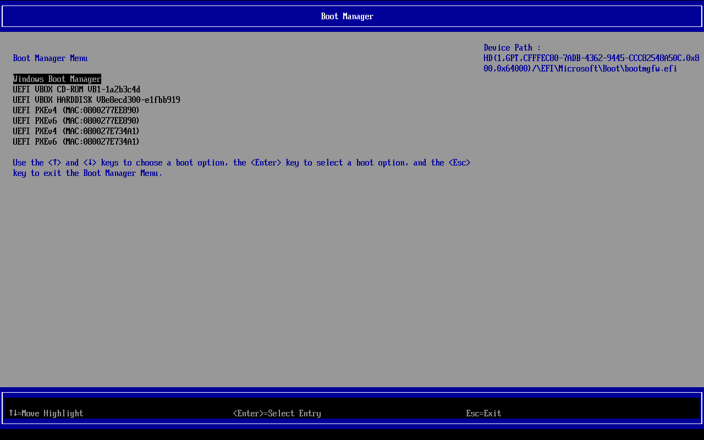

   - Issue: the CD-ROM boot entry initially failed instantly (black flash, back to menu). Turned out the optical drive had VBoxGuestAdditions.iso attached (left over from installing Guest Additions earlier), not the Windows 11 ISO, and a second attempt had added the Windows ISO as a separate drive rather than replacing it, leaving two ambiguous CD-ROM entries.
   
   - Decision: rather than continue untangling boot menu ambiguity and partition state left over from multiple partial install attempts, detached the existing CLIENT01.vdi entirely and created a brand new, genuinely blank 60GB virtual disk, removing the Guest Additions ISO so only the Windows 11 ISO remained attached. This gave a clean slate with no conflicting boot entries. 

   - Reinstalled Windows 11, this time entering the Pro key at the product screen. Confirmed working and later confirmed via a Pro-exclusive setup screen. 
   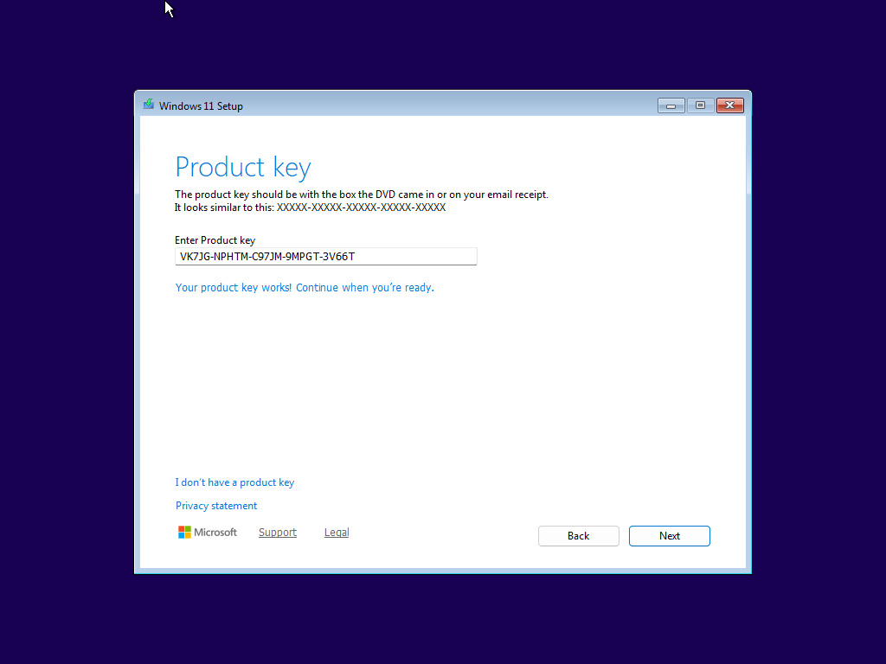

   - Issue: the offline/local account bypass (Fn+Shift+F10, oobe\bypassnro) appeared not to work this time, looping back to the same Microsoft sign-in screen after restart. Cause: this install had a genuinely working NAT internet connection (unlike the first install, where networking had been fully disabled). bypassnro removes the online requirement, but with real internet present Windows still defaults to the sign in flow rather than offering an offline path. Fix: disabled both network adapters via the VM's Devices menu, which forced the "I dont have internet" option to appear. Succesfully created a local account.

   - Re-enabled both network adapters, reinstalled Guest Additions, reassigned the static IP (192.168.56.20, DNS pointed at DC01), confirmed via "ipconfig" after identifying the correct adapter by MAC address. 

   - Confirmed Windows 11 Pro via Settings. 
   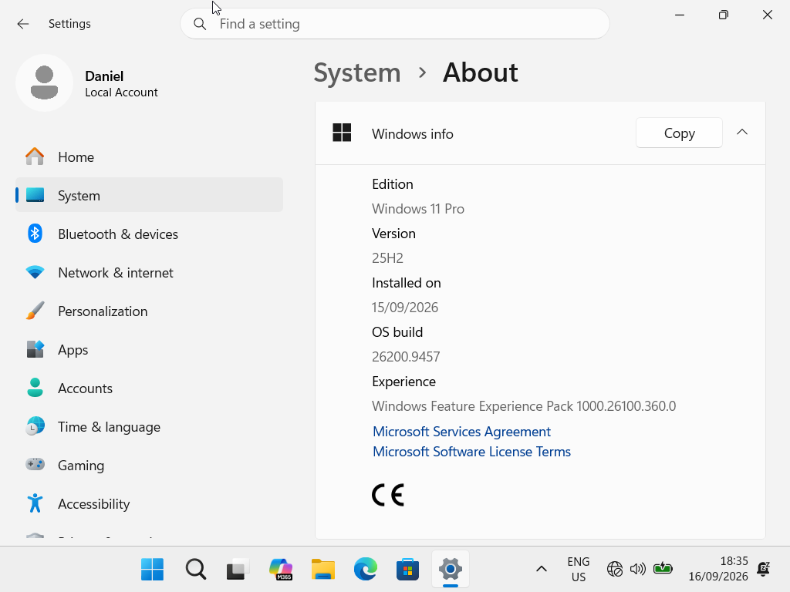

   - Domain join: System Properties > Change > Domain > lab.local. 
   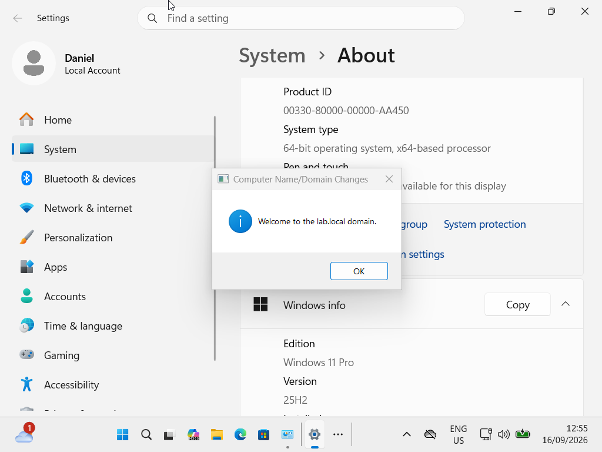

   - Verified the join two ways: logged into CLIENT01 using domain accounts (LAB\Administrator and LMessi) rather than the local account. Successful login confirms CLIENT01 is genuinely asking DC01 to authenticate, not checking a local account list. Also confirmed on DC01's side, in AD UC. 
   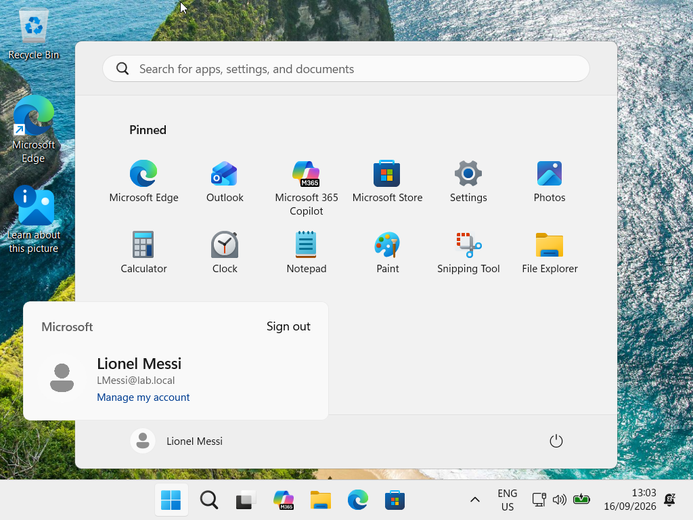
   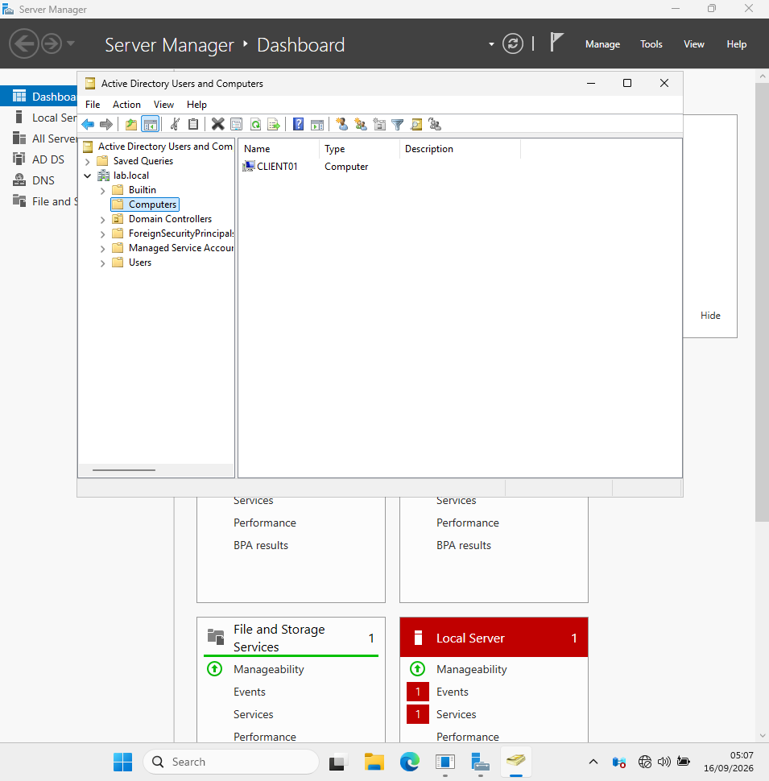

   # Day 6 - Building SPLUNK01 

   - Created SPLUNK01 VM: Linux type, Ubuntu OS Distribution, Ubuntu 25.04 (Plucky Puffin) (64-bit) OS Version. 4096MB, 2 CPU's, 50GB dynamically allocated disk slightly less space than DC01 and CLIENT01, since Ubuntu and SPLUNK need less base space.

   - Set up dual network adapters, same pattern as CLIENT01: Adapter 1 = Internal Network (detectionlab) for the isolated lab network, Adapter 2 = NAT for temporary internet access (downloading Ubuntu updates and the Splunk installer). Adapter 2 will be disabled before the attack simulation. 

   # Day 7 - Ubuntu Install and static IP

   - Set hostname to "splunk01" (lowercase in Linux since unlike Windows case insensitive naming), created a personal user account (not root, Ubuntu Server discourages direct root login, using sudo instead for admin commands).
   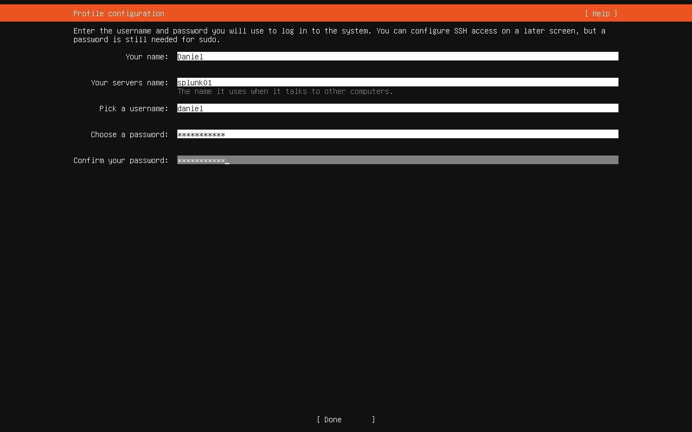

   - Installed OpenSSH server (ticked during setup). Allows remote terminal access to SPLUNK01 later, useful since theres no desktop and commands will otherwise need typing directly in the VM window.

   - Rebooted into the installed system successfully. Verified with "hostname" (correctly returned splunk01) and "ip a" (showed enp0s3 with no IP yet, enp0s8 auto-assigned 10.0.3.15 via NAT/DHCP as expected).
   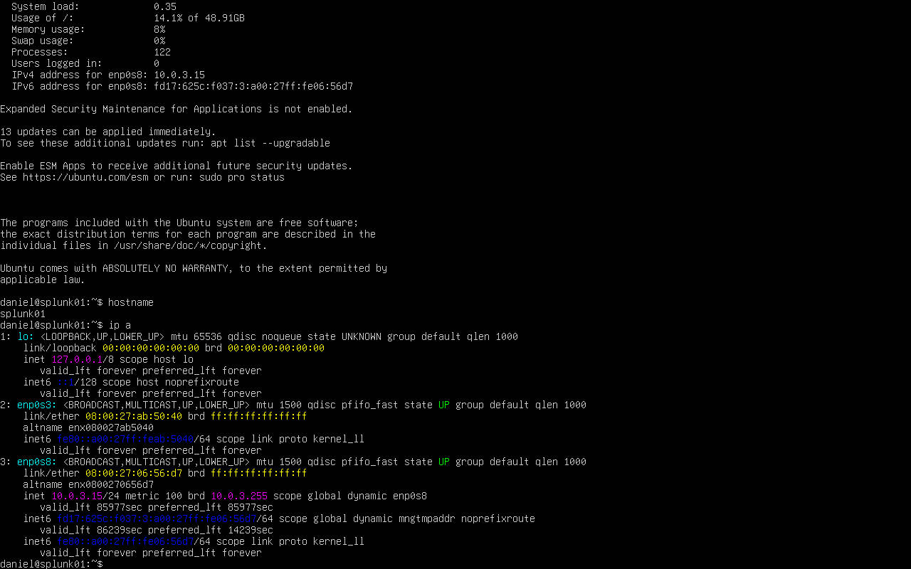

   - Assigned SPLUNK01's static IP via netplan (Ubuntu's network configuration system). Config lives in /etc/netplan/ as a YAML file. 

   - Checked "ls /etc/netplan/" and found actual filename was "00-installer-config.yaml". Edited file, setting enp0s3 (the detectionlab adapter) to a static address (192.168.56.30/24) with a DNS pointed at DC01 (192.168.56.10) leaving enp0s8 (NAT) untouched on DHCP. 
   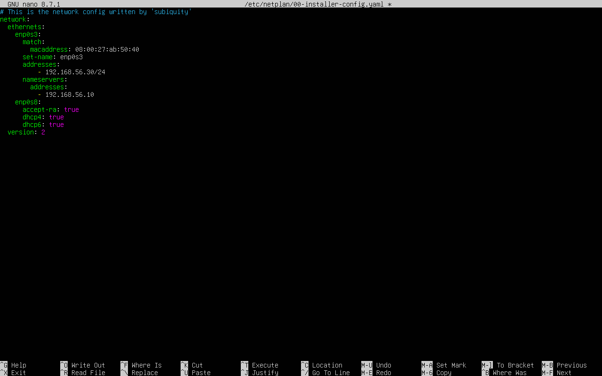

   - Confirmed via "ip a" that enp0s3 now shows 192.168.56.30/24 correctly. 
   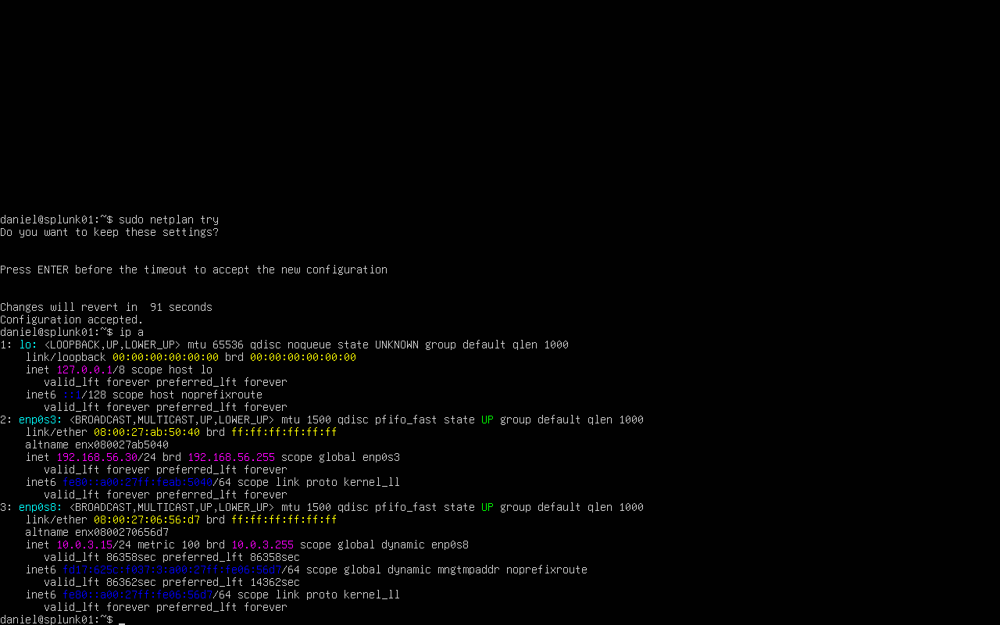

   - Verified connectivity to DC01 by doing "ping 192.168.56.10", confirming SPLUNK01 can reach DC01 across the detectionlab network. 
   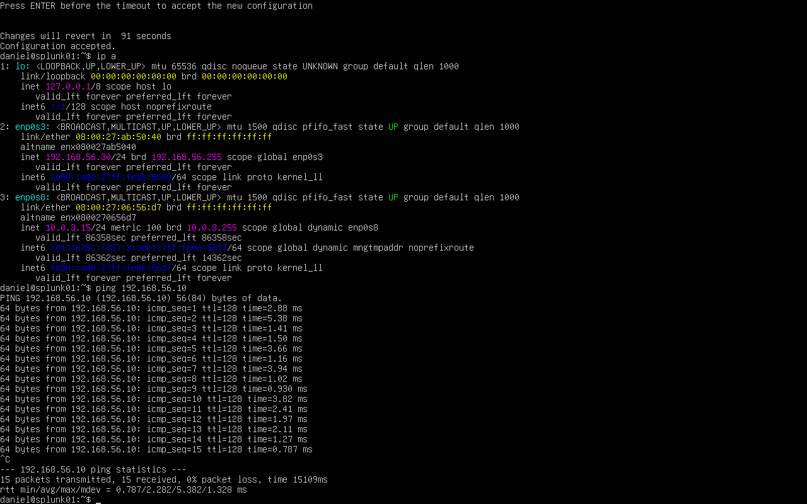

   # Day 8 - Installing Splunk Enterprise on SPLUNK01

   - Downloaded Splunk Enterprise (60 day full trial, converts to permanently free tier with a 500MB/day ingest cap afterward) directly onto SPLUNK01 using "wget" with the download link copied from splunk.com, rather than downloading on the host and transferring the file accross. 
   

   - Connected to SPLUNK01 via SSH, from a normal PowerShell window on the host laptop. This is why OpenSSH was installed during Ubuntu setup. 
   

   - Issue: SSH to SPLUNK01's direct IP (192.168.56.30) timed out. Root cause: "detectionlab" is a VirtualBox Internal Network, which is deliberately isolated not just from the internet but from the host laptop itself. Only VM's on that network can reach each other, the host has no presence on it at all. 

   - Fix: set up NAT port forwarding on SPLUNK01's Adapter 2 (the existing temporary NAT adapter) - host port 2222 -> guest port 22 (SSH), and host port 8000 -> guest port 8000 (added proactively, anticipating the same host cant reach Internal Network issue would otherwise block access to Splunks web dashboard later too). Connected successfully via "ssh daniel@127.0.0.1 -p 2222". 
   

   - Installed Splunk via "sudo dpkg -i splunk-10.4.3-4174a2deda5d-linux-amd64.deb". Installed cleanly into /opt/splunk. 
   

   - Started Splunk for the first time. sudo /opt/splunk/bin/splunk start --accept-license. Got a deprecation notice requiring explicit confirmation to run as root - re-ran with --run-as-root added, which proceeded normally. Created the Splunk web admin account (username: DanielSplunk) when prompted. 

   - Confirmed Splunk running: accessed the web interface at  http://127.0.0.1:8000 (via the port forward) from the host browser, logged in successfully with the Splunk admin account, and had a first successful look at Splunk's actual dashboard. 
   
   

   # Day 8 (continuation)- Installing Universal Forwarder on DC01

   - Downloaded the Splunk Universal Forwarder (Splunks small, separate piece of software whose only job is watching logs on the machine its installed on and forwarding copies to SPLUNK01). 
   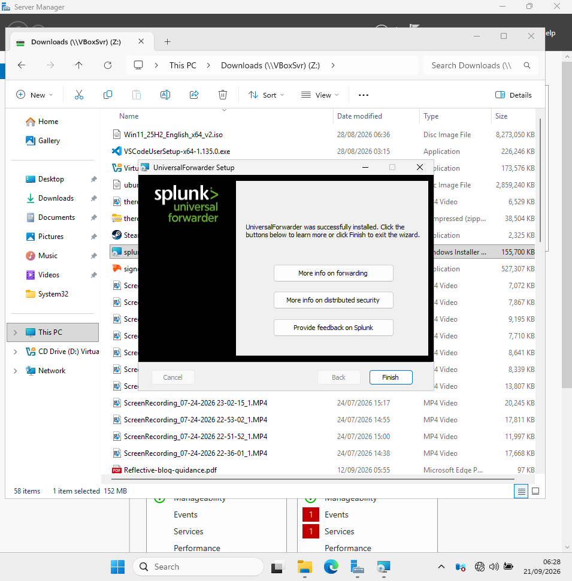

   - Set up a VirtualBox Shared Folder (DC01 Settings > Shared Folders, pointed at the hosts Downloads folder, read only) to get the .msi file into DC01. Appeared inside DC01 as a network drive (Z:), avoiding the isolated network transfer problem entirely for this file type. 
   

   - Installed the Universal Forwarder inside DC01: created dedicated service credentials (username: DanielSplunkUF), skipped Deployment Server config (not needed for 2 forwarders), configured the Receiving Indexer as 192.168.56.30:9997 (SPLUNK01's IP, port 9997 - Splunks standard forwarder receiving port, separate from port 8000 used for the web dashboard).
   

   - Issue: after install, "index=windows" search on SPLUNK01 returned 0 events, despite the Forwarder showing as installed and configured. 
   

   - Diagnosis step 1: confirmed via Test-NetConnection on DC01 that port 9997 was reachable (TcpTestSucceeded: True), and "sudo ufw status" on SPLUNK01 showed the firewall inactive - ruled out network/firewall as the cause. 
   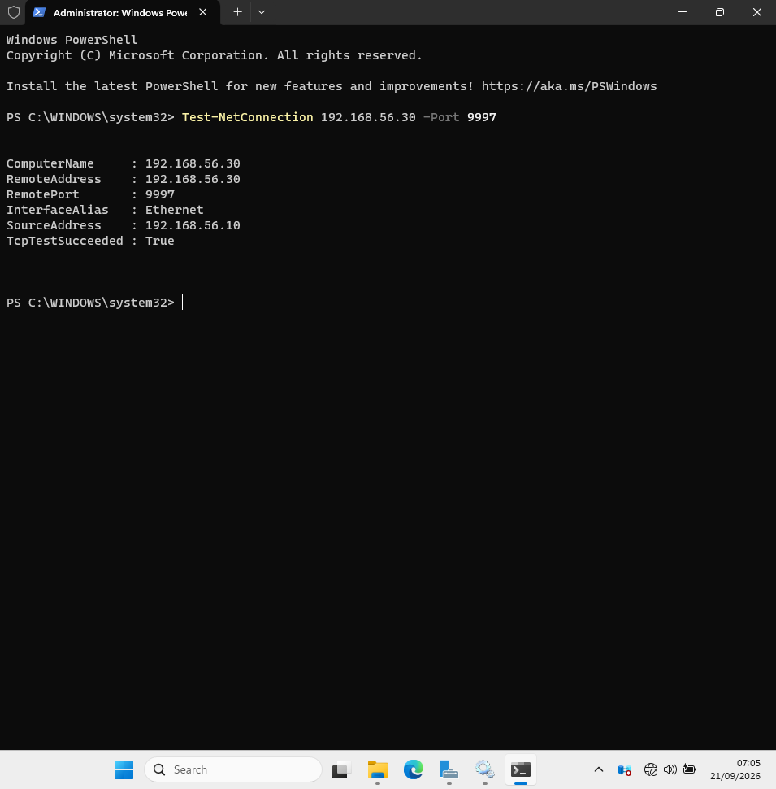 
   

   - Root cause found: SPLUNK01 was never explicitly configured to receive forwarded data at all - creating the index only creates storage, it doesnt open a listening port. Fixed via Settings > Forwarding and receiving > Configure receiving > New Receiving Port > 9997 on SPLUNK01. 

   - Second issue found: even after receiving was enabled, still 0 events in index=windows. Discovered the Forwarder also needs an explicit "data input" telling it what to actually watch and forward (a separate configuration step from telling it where to send data). Created "inputs.conf" in "C:\Program Files\SplunkUniversalForwarder\etc\system\local\" with a "[WinEventLog://Security]" stanza to specifically monitor the Windows Security event log.
   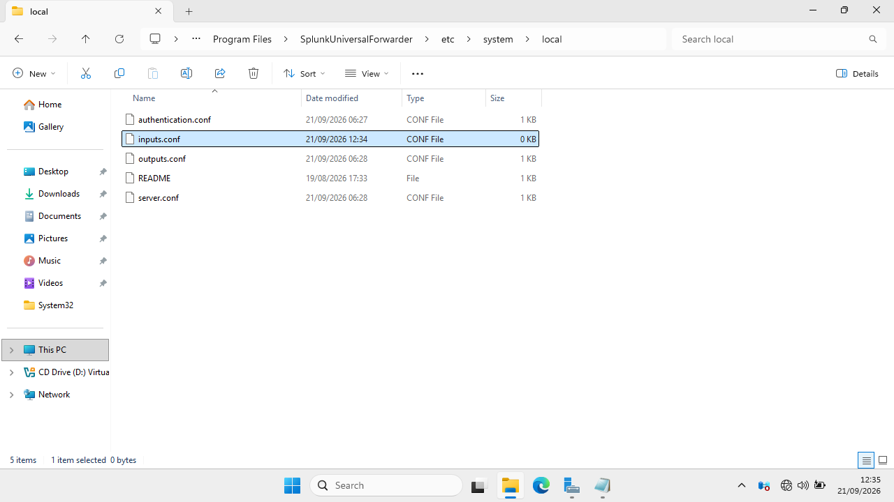

   - Third issue found: "index=*" search confirmed 5000+ events were arriving from DC01 successfully, but all landing in Splunks default "main" index rather than the intended "windows" index, meaning "index=windows" legitimately returned 0 despite forwarding actually working. 
   

   - Root cause: inputs.conf had been typed as a single line in Notepad (silly me), rather than 3 separate lines. Splunks .conf format requires each stanza header and key=value pair on its own line, so "index=windows" was never being parsed as a distinct setting, only "disabled=false" took effect. Now, rewrote inputs.conf as 3 separate lines, saved, restarted SplunkForwarder service. 
   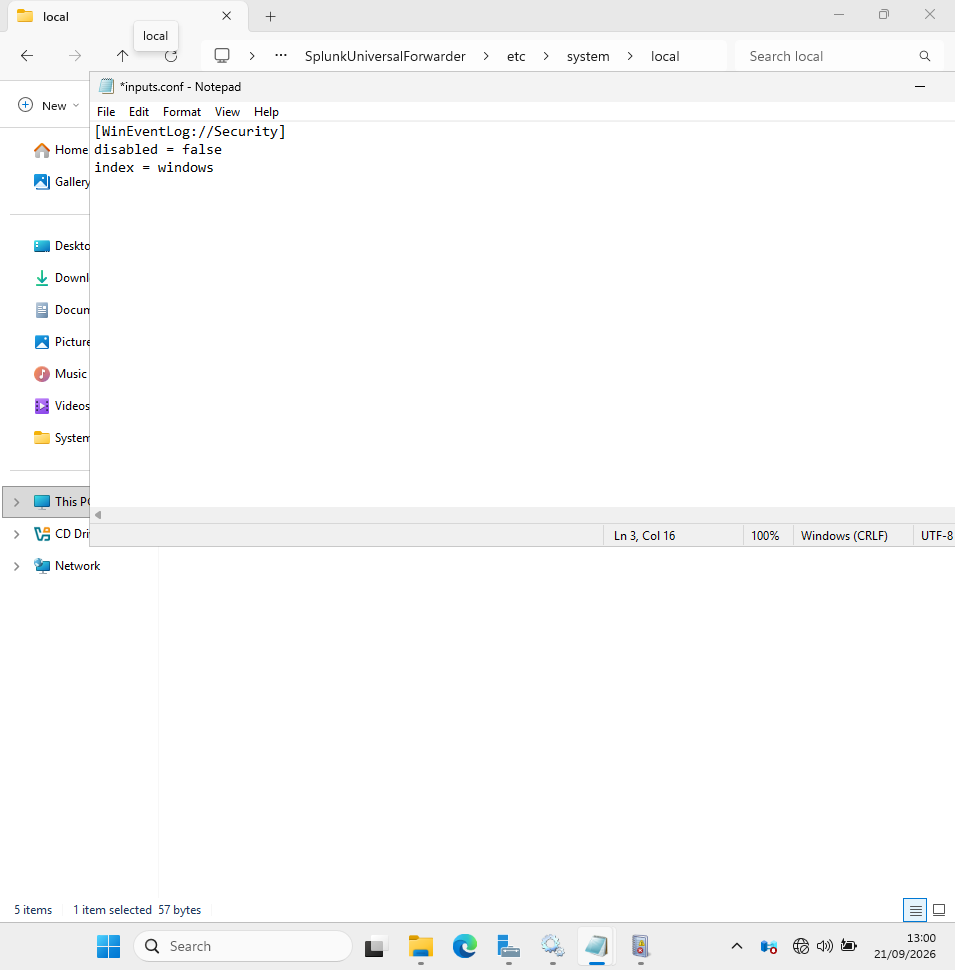

   - Verified: "index=windows" in Splunks Search & Reporting now correctly shows real events from DC01, full chain confirmed working end to end, from DC01's Security log through to a searchable index on SPLUNK01. 
   

   # Day 9 - Installing Universal Forwarder on CLIENT01

   - Installed the Universal Forwarder on CLIENT01, reusing the same .msi already downloaded to the host laptop from DC01's setup. Used the same VirtualBox Shared Folder approach to transfer the installer. 

   - Configured the installer the same way as DC01: dedicated service credentials, skipped Deployment Server, set Receiving Indexer to 192.168.56.30:9997 (same SPLUNK01 destination both forwarders send to).

   - Created inputs.conf file, same way as DC01. Verified in Splunks Search & Reporting with "index=windows | stats count by host" - confirmed two distinct hosts now present: CLIENT01 and WIN-2U5EUPPQBPR (DC01s actual Windows computer name).
   

   - Took "Splunk logging working" snapshots across all 3 VM's. 

   # Verifying Windows Audit Policy

   - Checked DC01s Logon audit setting via Local Security Policy (secpol.msc > Advanced Audit Policy Configuration > Logon/Logoff > Audit Logon). Showed "Not Configured" with Success/Failure unticked. Did not change this, since DC01 is a Domain Controller and is primarily governed by domain level Group Policy (Default Domain Controllers Policy), which overrides local policy. 
   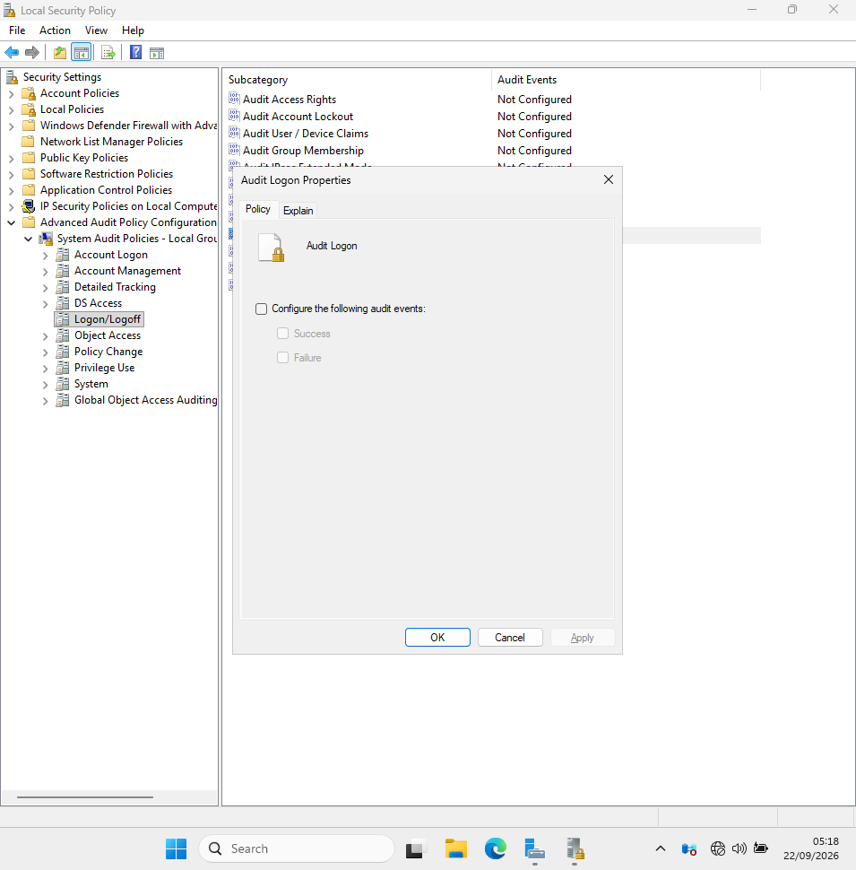

   - Used "auditpol /get /subcategory:Logon", run from an elevated Command Prompt, instead, which shows the real, currently effective audit setting regardless of which policy layer (local vs domain) is providing it. Confirmed on DC01:Logon = Success and Failure. No changes needed, the domain level policy already had this correctly configured by default. 
   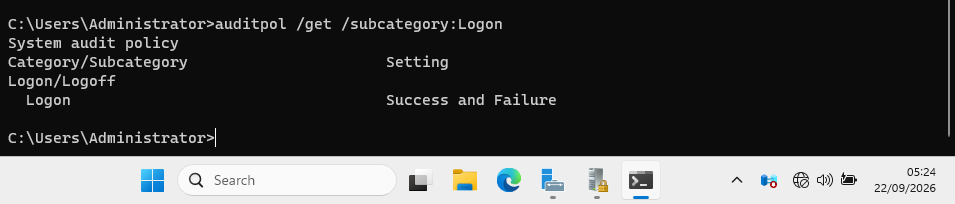

   - Ran same auditpol check on CLIENT01, confirmed Success and Failure already enabled by default. No changes needed on either machine. 
   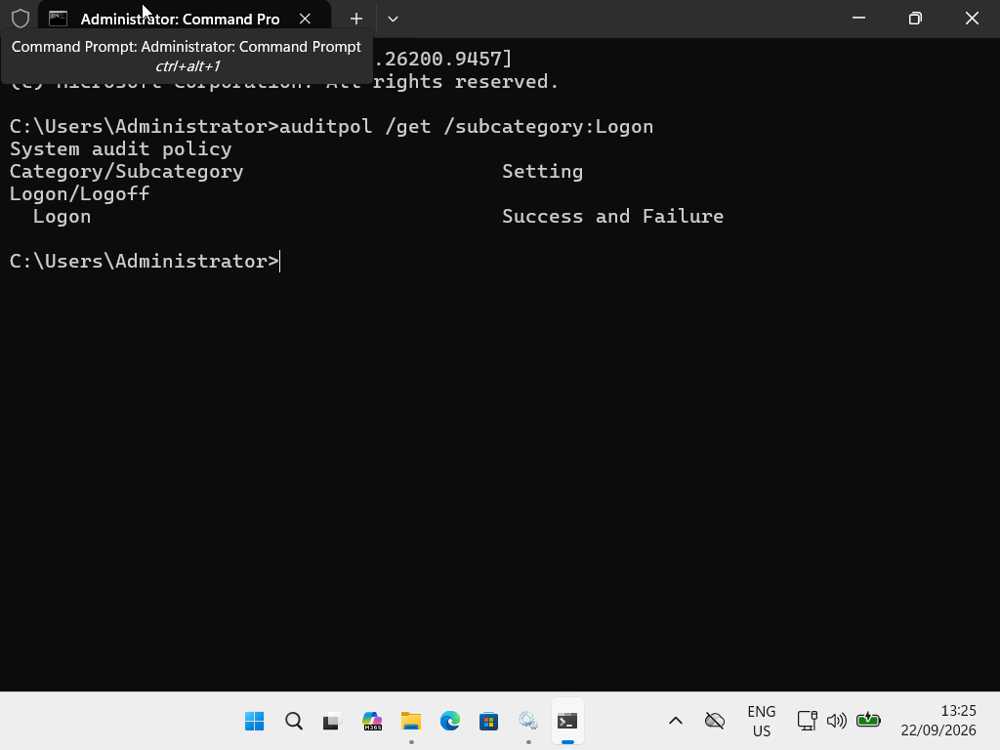

   - Generated one deliberate failed login (wrong password) and one successful login on CLIENT01, then confirmed both appeared correctly in Splunk:EventCode=4625 and 4624. 
   
   

   - Audit policy verified as correctly configured (via effective policy, not just local settings) on both DC01 and CLIENT01, with end to end proof via a real generated success/failure pair confirmed in Splunk.

   # Day 10 - Capture Authentication Baseline on CLIENT01

   - Generated the full set of planned baseline authentication activity on CLIENT01:
      - Successful login (LMessi)
      - One deliberate wrong password attempt, then correct login
      - Logins as 3 more test users (SAbrar, CRonaldo, KMbappe)
      - Workstation lock/unlock (Win+L)
      - Administrator Login
   
   - Verified in Splunk with "index=windows host=CLIENT01 (EventCode=4624 OR EventCode=4625 OR EventCode=4800 OR EventCode=4801) | table _time, EventCode, Account_Name". Confirmed 4624 (success) and 4625 (failure) events for all the above, but 4800/4801 (lock/unlock) were absent despite pressing Win+L.
   
   

   - Investigated: checked the specific audit subcategory governing lock/unlock events using "auditpol /get /subcategory:"Other Logon/Logoff Events"auditpol /get /subcategory:"Other Logon/Logoff Events"", which confirmed "No Auditing". This is a different subcategory from Logon (which governs 4624/4625 and was verified as enabled previously). Audit policy is controlled independently per subcategory, so one being enabled doesnt mean others are. This subcategory had simply never been checked or enabled. 
   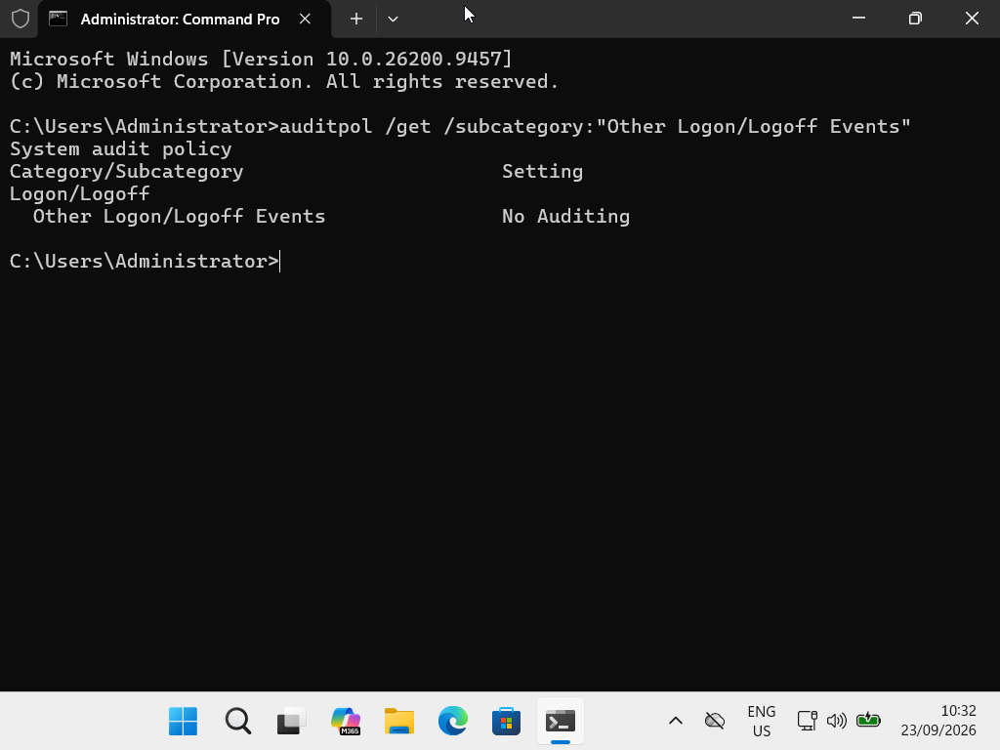

   - Fix: enabled it directly with "auditpol /set /subcategory:"Other Logon/Logoff Events" /success:enable /failure:enable". Re ran the lock/unlock test, and this time 4800 and 4801 appeared correctly in Splunk.
   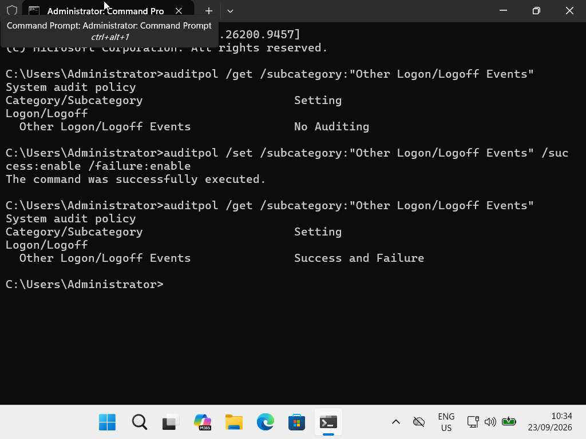
   

   - All 5 categories (success, one accidental failure, multiple users, lock/unlock, admin login) confirmed present and correctly categorised in Splunk. 

   

 
